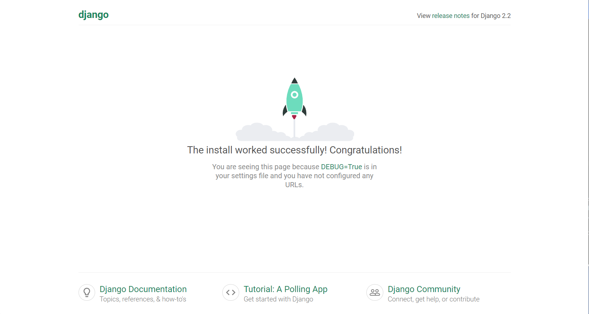

## Django搭建工程

* mkvirtualenv -p python3 django(此步骤可选)

* `pip install django`

* workon django(如果没执行第一步创建虚拟环境 则可跳过此步骤)

* django-admin startproject demo (执行后，会多出一个新目录名为demo，此即为新创建的工程目录)

* 进入demo目录后 会有一个和项目目录同名的文件夹demo和manage.py文件

* 同名demo目录内部各文件说明：
  * **settings.py** 是项目的整体配置文件。
  * **urls.py** 是项目的URL配置文件。
  * **wsgi.py** 是项目与WSGI兼容的Web服务器入口。
  * **manage.py** 是项目管理文件，通过它管理项目。

* 此时可在终端运行`python manage.py runserver ip:port`来启动服务器 不指定ip和port默认运行在127.0.0.1:8000

在浏览器地址栏输入127.0.0.1:8000或者localhost:8000后回车 出现上图则表示项目搭建成功

**温馨提示**

* jango默认工作在调式Debug模式下，如果增加、修改、删除文件，服务器会自动重启。
* 按ctrl+c停止服务器。

